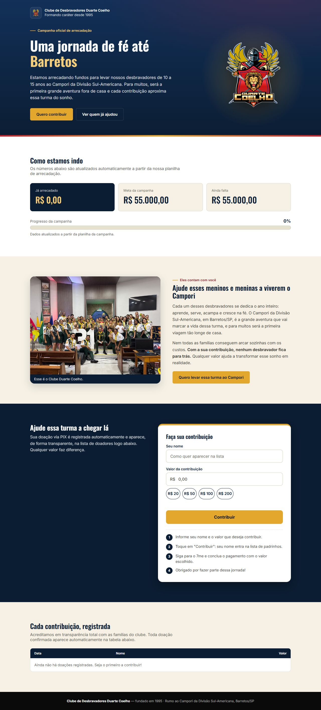
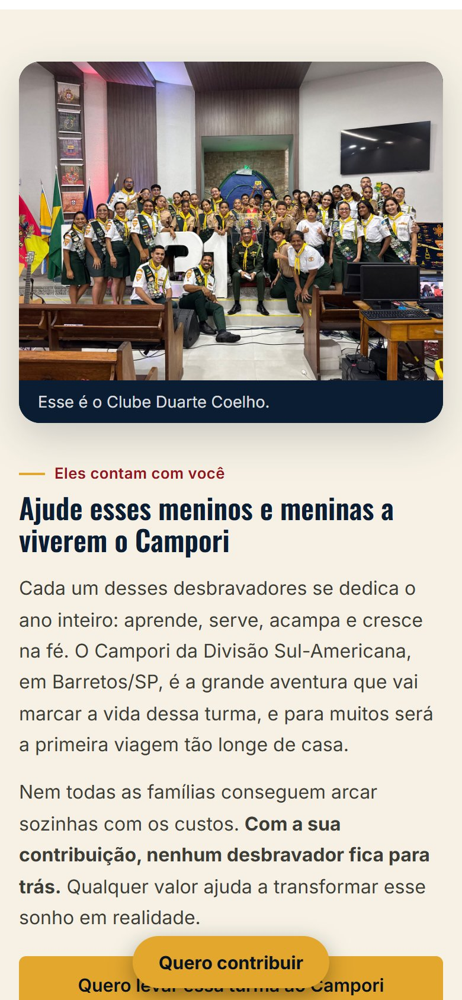

# Rumo a Barretos — Clube de Desbravadores Duarte Coelho

Site da campanha **"Rumo a Barretos"**, feito para o **Clube de Desbravadores Duarte Coelho**.

**Versão 1.0.0** · **Site no ar: https://campanha-clube-duarte-coelho.web.app**

## Sobre o projeto

Este é um **projeto voluntário**, desenvolvido sem fins lucrativos para apoiar o Clube de Desbravadores Duarte Coelho em sua jornada de fé e na arrecadação da campanha.

O objetivo é levar os desbravadores de 10 a 15 anos ao Campori da Divisão Sul-Americana, em Barretos/SP.

## Como o site é



### No celular

<p>
  
  
  
  
</p>

## Funcionalidades

- **Painel de progresso:** valor arrecadado, meta e quanto falta, com barra de progresso atualizada automaticamente.
- **Formulário de doação:** nome, valor e valores sugeridos (R$ 20, 50, 100 e 200). O valor é copiado e a pessoa segue para o pagamento no 7me.
- **Lista de doadores:** transparência com as famílias do clube.
- **Responsivo:** pensado primeiro para o celular, com botão fixo "Quero contribuir", e confortável também no computador.
- **Seguro:** regras do banco que só permitem criar doações válidas (sem editar nem apagar) e cabeçalhos de segurança no Hosting.

## Tecnologias

- HTML, CSS e JavaScript puro
- [Firebase](https://firebase.google.com/) (Hosting e banco de dados)

## Estrutura

```
.
├── public/                  # Tudo que é publicado no Firebase Hosting
│   ├── index.html           # Página principal da campanha
│   ├── css/style.css        # Estilos do site
│   ├── js/
│   │   ├── firebase-config.js  # Config pública do Firebase (único arquivo a trocar ao migrar de projeto)
│   │   └── script.js        # Lógica da página e integração com o Firebase
│   └── assets/images/       # Imagens do site (foto da turma, ícone)
├── docs/screenshots/        # Imagens usadas neste README
├── database.rules.json      # Regras de segurança do Realtime Database
├── firebase.json            # Configuração de deploy e cabeçalhos de segurança
├── .firebaserc              # Projeto Firebase padrão
└── README.md
```

## Como rodar localmente

Basta abrir o `public/index.html` no navegador, ou servir a pasta com qualquer servidor estático:

```bash
npx serve public
```

## Deploy

```bash
npm i -g firebase-tools
firebase login
firebase deploy        # publica o site e as regras do banco
```

## Contribuições

Por ser um projeto voluntário, sugestões e melhorias são bem-vindas. Abra uma *issue* ou envie um *pull request*.

---

Feito com carinho, como voluntário, para o Clube de Desbravadores Duarte Coelho.
